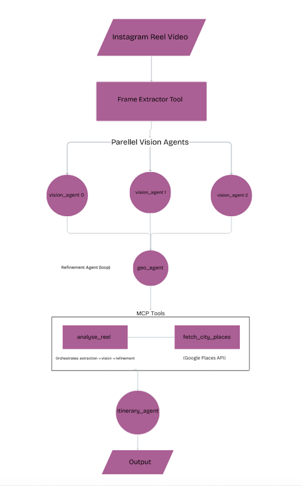
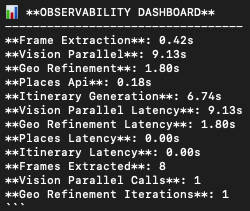
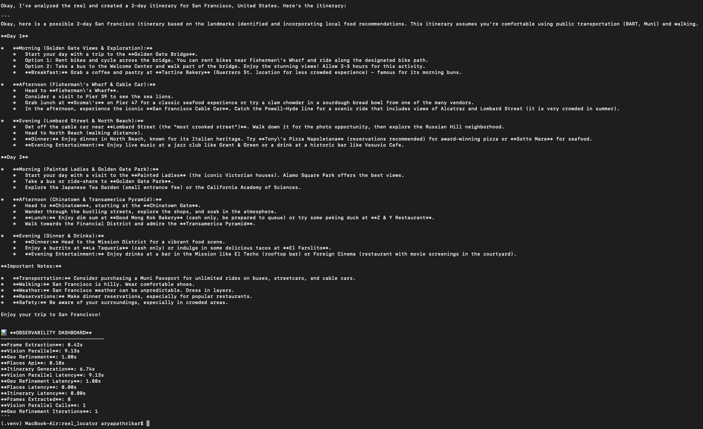

# 🚀 Project Overview — Reel Locator (Multi-Agent Travel Intelligence System)

> The project demonstrates practical application of Google ADK, MCP, A2A, parallel reasoning, long-running operations, context engineering, and observability.

---

## 🎯 Problem Statement

While travel content on social media platforms (Reels, Shorts, TikToks) inspires millions of users daily, there's a significant gap between **discovering a destination** and **planning an actual trip**.

The manual process of converting a travel reel into a practical itinerary involves several time-consuming steps:

* **Location identification**: Determining the exact city, country, or landmark shown in a video often requires manual research and cross-referencing multiple sources.

* **Attraction discovery**: Finding authentic local attractions, restaurants, and activities typically involves switching between multiple apps and websites (Google Maps, TripAdvisor, Yelp, etc.).

* **Itinerary planning**: Creating a structured, multi-day itinerary that balances must-see landmarks with local experiences requires both destination knowledge and time to research logistics.

* **Scalability**: Repeating this workflow for multiple destinations or reels becomes increasingly time-consuming, making it impractical for users who want to explore multiple travel options.

This friction prevents many users from acting on travel inspiration, leaving potential trips unplanned despite abundant visual content available online.

---

## 💡 Solution Statement

**Reel Locator** automates the entire workflow using **multi-agent reasoning**.

The user simply provides a reel (video clip).

The system:

### 1️⃣ Extracts key frames

### 2️⃣ Runs **parallel LLM-powered vision agents**

### 3️⃣ Uses a **loop refinement agent** to improve predictions

### 4️⃣ Fetches real places via **Google Places API**

### 5️⃣ Generates a clean **2-day itinerary**

### 6️⃣ Supports memory, sessions, observability, context compaction

### 7️⃣ Runs through **A2A protocol**, making it compatible with any ADK client

This pipeline transforms a raw video into a personalized travel plan in seconds.

---

# 🧱 Architecture

Reel Locator follows a **distributed multi-agent architecture** where specialized agents handle distinct responsibilities within the pipeline. Rather than a monolithic application, the system is composed of independent agents that communicate through Google ADK's Agent-to-Agent (A2A) protocol and Model Context Protocol (MCP) tools.
Each agent specializes in a narrow domain and cooperates via ADK + MCP.

The architecture enables:
* **Modularity**: Each agent can be developed, tested, and optimized independently
* **Scalability**: Agents can be scaled horizontally based on workload
* **Maintainability**: Clear separation of concerns makes the system easier to understand and modify
* **Extensibility**: New agents or tools can be added without disrupting existing components



*Architecture diagram showing the complete multi-agent pipeline from Instagram Reel input to itinerary output*

The entire pipeline is orchestrated by a **Root Travel Agent** that coordinates tool calls, manages session state, and ensures proper sequencing of operations. This agent operates as an A2A service, making it accessible to other agents and external systems.

---

# 🧠 Agent System Breakdown

## **1. Root Agent (A2A-enabled Travel Planner)**

The top-level orchestrator that:

* Handles user input

* Injects compacted session memory

* Calls MCP tools in the correct order

* Formats the final itinerary

* Operates entirely through A2A protocol

---

## **2. Parallel Vision Agents**

Three identical LLM vision agents run *simultaneously*, providing redundancy and robustness.

Each agent:

✔ Analyzes all frames

✔ Extracts landmarks

✔ Produces city/country candidates

✔ Outputs confidence scores

Results are merged via weighted confidence.

---

## **3. Loop Refinement Agent**

A sequential **LoopAgent** pattern:

* Input: merged vision results

* Each iteration: refine metadata (city, country, region)

* Evaluates confidence

* Stops early if threshold met

* Guarantees stability and improvement

This demonstrates *loop agents*, *sequential agents*, and *evaluation logic*.

---

## **4. Itinerary Agent**

Generates a:

* Clean

* Ordered

* Human-readable

* 2-day itinerary

Using locality-aware LLM reasoning and Places metadata.

The agent output includes:
* **Location Summary**: Detected city, country, and region
* **Landmarks List**: All landmarks identified from the video
* **Detailed Itinerary**: Day-by-day plan focusing on detected landmarks
* **Observability Dashboard**: Performance metrics and timings

---

## **5. MCP Tooling**

Reel Locator includes **four MCP tools**:

### 🛠 analyze_reel

Runs full vision + geo inference.

### 🛠 fetch_city_places

Queries Google Places API for attractions.

### 🛠 plan_itinerary_from_reel

Full pipeline orchestrator.

### 🛠 get_observability_metrics

Returns a full metrics dashboard.

---

# 🔍 Observability (Logging, Tracing, Metrics)

Reel Locator tracks:

* Timings:

  * frame_extraction

  * vision_parallel

  * geo_refinement

  * places_api

  * itinerary_generation

* Counters:

  * frames_extracted

  * vision_parallel_calls

  * geo_refinement_iterations

* Latency per stage

Example readable output:



*Real-time metrics showing execution times, latencies, and operational counts for each pipeline stage*

---

# 🧬 Context Engineering & Memory

The agent uses:

✓ Session context

✓ Compacted memory block

✓ Injected memory prefix into instruction prompt

✓ Persistent agent behavior across runs

This ensures the agent remembers **past user preferences**.

---

# 🌐 A2A Protocol

The agent runs as a full **A2A service**:

```
http://localhost:9000
```

This allows:

* Agent-to-agent communication

* External orchestrators

* Postman / HTTP testing

* ADK Web mode integration

---

# 📦 Project Structure

```
reel_locator/
│
├── adk_agent/
│   ├── agent.py            # A2A root agent
│   └── memory_bank.py      # Custom memory implementation
│
├── mcp_server/
│   └── mcp_server.py       # MCP tooling
│
├── rl_agents/
│   ├── vision_agent.py
│   ├── parallel_vision.py
│   ├── geo_agent.py
│   ├── itinerary_agent.py
│   └── refinement_agent.py
│
├── tools/
│   └── extract_frames.py   # Frame extraction utility
│
├── observability/
│   ├── obs.py              # Metrics and timing
│   └── dashboard.py        # Metrics dashboard
│
├── ui/
│   └── app.py              # Streamlit web interface
│
├── data/
│   ├── input/reel.mp4
│   └── frames/
│
└── README.md
```

---

# 🧪 Workflow

1. User uploads reel

2. Frames extracted

3. Parallel agents analyze frames

4. Loop agent refines predictions

5. Google Places fetches local attractions

6. Itinerary is generated

7. Observability metrics logged

8. Final markdown returned

---

# 🔧 Installation

```bash
python3 -m venv .venv
source .venv/bin/activate
pip install -r requirements.txt
```

Add your `.env`:

```
GOOGLE_API_KEY=...
GOOGLE_PLACES_API_KEY=...
```

---

# ▶️ Running the Agent

## A2A Server Mode (Default)

Start the A2A server which stays running on port 9000:

```bash
python -m adk_agent.agent
```

The agent is now live at:

```
http://localhost:9000
```

## CLI Test Mode

Run a one-time test and exit:

```bash
python -m adk_agent.agent --cli
```

## Streamlit UI

Launch the interactive web interface:

```bash
streamlit run ui/app.py
```

The UI provides:
- Video upload interface
- Real-time processing status
- Formatted itinerary display with location and landmarks summary
- Session management

The UI calls the agent directly (no A2A server required when using the UI).

---

# 📊 Example Output

Here's a real example of the system processing a San Francisco travel reel and generating a complete 2-day itinerary:



*Complete 2-day San Francisco itinerary generated from a travel reel, including landmarks, local food recommendations, and detailed day-by-day activities*

<<<<<<< HEAD
## 🎥 Demo Video

Watch the project in action:

[](https://youtu.be/3aonG1f_xyY)

[**Watch on YouTube**](https://youtu.be/3aonG1f_xyY) - Complete walkthrough showing the system analyzing a travel reel and generating a personalized itinerary.

---

# 🎯 Value Statement

Reel Locator reduces a **45–60 minute** manual task into **under 10 seconds**.

It demonstrates:

* Multi-agent parallelism

* Loop refinement

* Real API integration

* Observability

* MCP tool usage
=======
>>>>>>> 7cf491c761bebfed136c35a1412f6c9575729311

* A2A protocol

* Complex orchestration

This project shows how modern agentic systems can convert *unstructured video signals* into actionable plans with high reliability.
